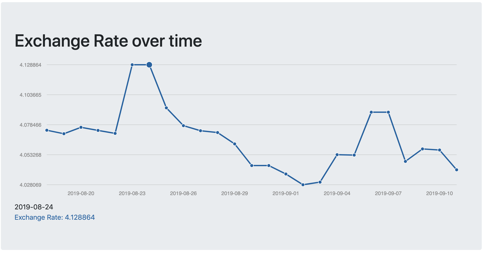

# exchange_rates
Exchange rate project

1) Login using Google OAuth.

2) Input amount and select target currency.

3) Calculate rates.
  
  -> See graph of exchange rate over time
  
  -> See a list of historic calculations you made

Example of Graph:

